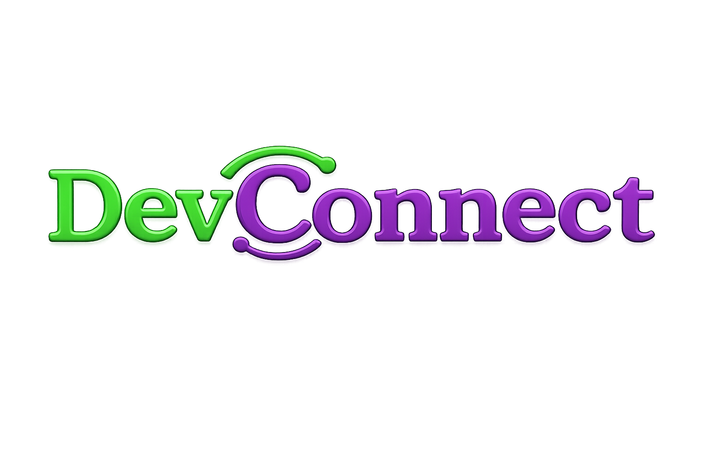
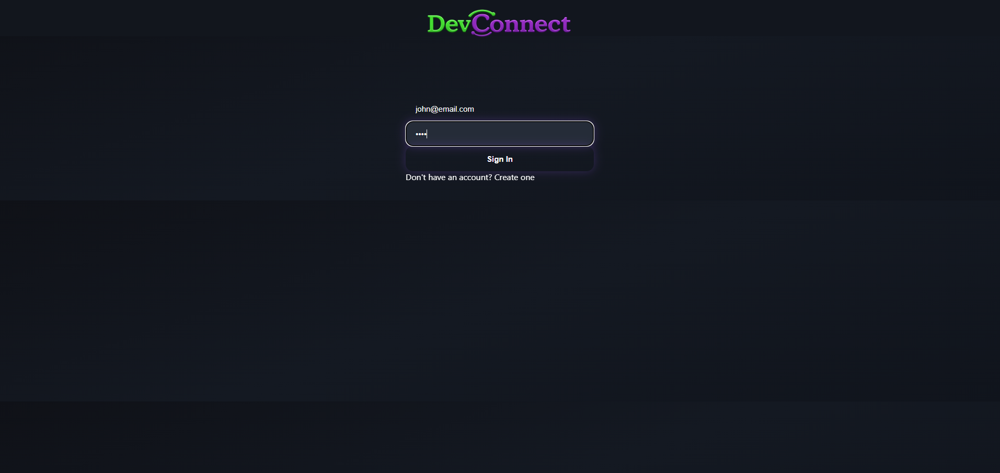
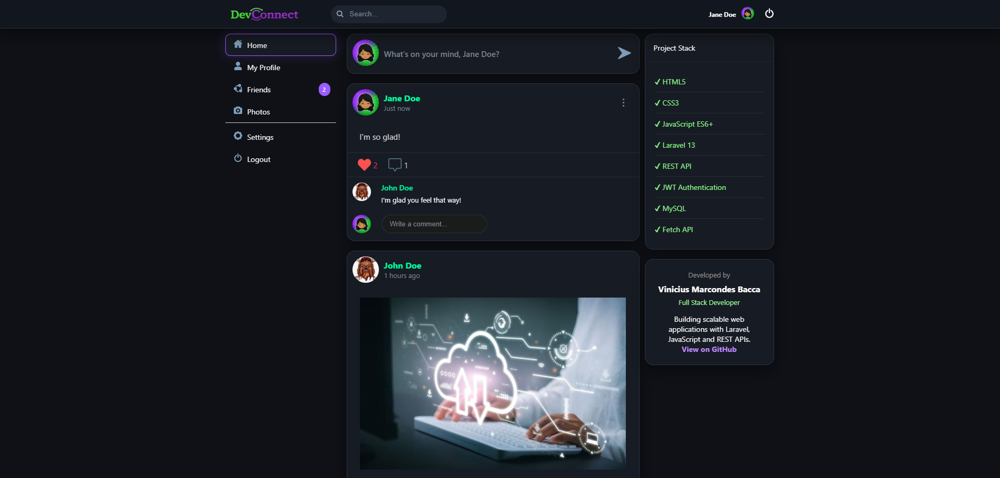
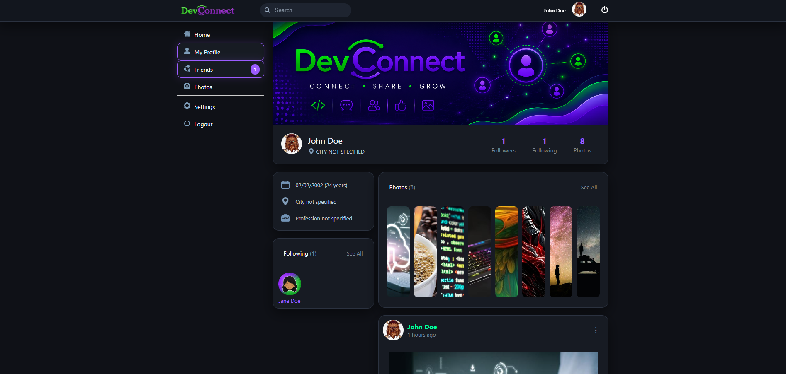
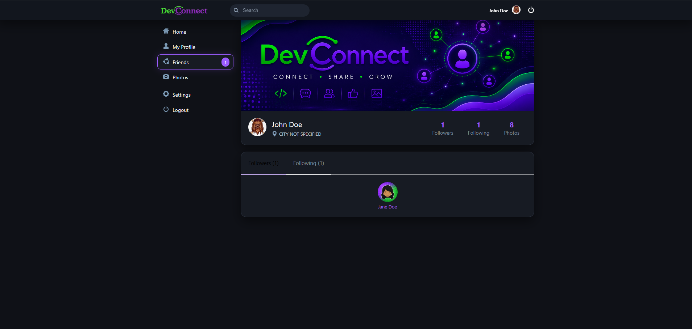
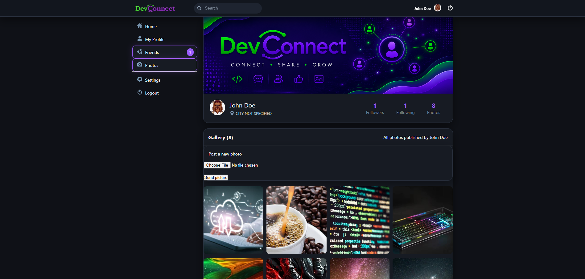

<p align="center">
  
</p>

<h1 align="center">DevConnect Frontend</h1>

<p align="center">
A modern social networking frontend built with HTML5, CSS3 and Vanilla JavaScript,
consuming a Laravel REST API secured with JWT Authentication.
</p>

<p align="center">


</p>

---

# 📖 About the Project

DevConnect is a social networking application developed as a full-stack portfolio project to demonstrate frontend integration with a RESTful API.

The application implements authentication using JWT, CRUD operations, image uploads, user interactions, profile management, and responsive layouts using only HTML, CSS, and Vanilla JavaScript.

The frontend communicates with a Laravel backend through REST endpoints, following a clear separation between presentation and business logic.

---

# 📸 Screenshots

## Login



---

## Home Feed



---

## User Profile



---

## Friends



---

## Photos



---

# ✨ Features

## Authentication

- User registration
- Secure login using JWT Authentication
- Persistent user session
- Protected routes

## Feed

- Create text posts
- Upload photo posts
- Delete own posts
- Like posts
- Comment on posts
- Chronological timeline

## User Profile

- Update avatar
- Update cover image
- Personal information
- Followers & Following counters
- Personal gallery
- User timeline

## Friends

- View following users
- Navigate to user profiles

## Photos

- Responsive photo gallery
- Image uploads

## Search

- Search users by name

---

# 🛠 Tech Stack

### Frontend

- HTML5
- CSS3
- Vanilla JavaScript (ES6+)
- Fetch API

### Backend

- Laravel
- REST API
- JWT Authentication
- MySQL

---

# 📁 Project Structure

```text
assets/
├── css/
├── images/
├── js/

media/

screenshots/

friends.html
index.html
login.html
photos.html
profile.html
signup.html
README.md
```

---

# 🚀 Getting Started

Clone the repository

```bash
git clone https://github.com/VMBacca/devconnect-frontend.git
```

Open the project using **Live Server** (VS Code) or any static HTTP server.

Make sure the DevConnect API is running before accessing the application.

---

# 🔗 Backend Repository

https://github.com/VMBacca/devconnect-api

---

# 🗺 Roadmap

Planned improvements for future versions:

### Social Features

- Friend request system
- Accept / Reject friend requests
- User notifications
- Direct messaging (chat)

### User Experience

- Better session expiration handling
- Infinite scrolling
- Loading skeletons
- Toast notifications
- Improved search experience

### UI Improvements

- Profile gallery modal
- Dark / Light theme
- Profile customization
- UI animations
- Complete removal of the legacy Vanilla Modal system

### Performance

- API request optimization
- Lazy loading
- Frontend code refactoring

---

# 👨‍💻 Author

**Vinicius Marcondes Bacca**

Backend Developer (.NET) | Laravel | QA Automation

GitHub:
https://github.com/VMBacca

LinkedIn:
https://www.linkedin.com/in/viniciusmarcondesbacca/

---

# 📄 License

This project was developed for educational purposes and as part of my software development portfolio.
